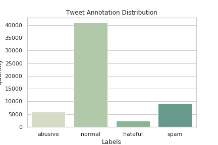

### Data Processing 
1. Remove mentions
2. Remove URLs
3. Remove symbols and digits
4. Remove extra white spaces
5. Spell check using [big.txt](https://norvig.com/big.txt)
   * Tends to filter out curse words 
6. Filter out stop words 

### Dataset Analytics 
Source: [80k annotated tweets](http://www.aclweb.org/anthology/N16-2013)

### Testing 
`python -m unittest -v tests.py`

### Results

1. Create a results directory. 
2. All experiments are output to folders with experiment name and `results.csv` files. For example, run baseline experiments by walking through `logistic_regression.ipynb`. 
3. Run `python synthesize_results.py` to aggregate all experiments in global `experiments.csv` spreadsheet. 

